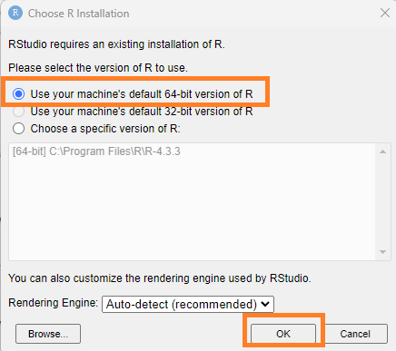

R and RStudio are two different programs that need to be downloaded separately.
R is a programming language and RStudio is front end application that helps you
you write R code, view plots, and manage projects.

These instructions will walk you through downloading and installing R and RStudio
for Windows.

## Download and Install R

#### 1. To install R, go to cran.r-project.org and click "Download R for Windows"

---

#### 2. Click on "install R for the first time".

---

#### 3. Click the URL to download the latest version of R.

---

#### 4. After selecting your preferred language and reading the licensing notice, select the appropriate folder. Ideally in Windows, the R installation would be under "C:\\Program Files\\".

---

#### 5. Select all of the component installations and be sure that you have the available disk space.

---

#### 6. Choose the default settings.

---

#### 7. Choose "R" as the Start Menu Folder.

---

#### 8. Be sure to "Save version number in registry" and "Associate R with .RData files".

---

#### 9. Click Finish to complete the setup.

---

## Download and Install RStudio

#### 1. Go to https://posit.co/downloads/ and download RStudio Desktop.

 

#### 2. Begin the installation setup.

#### 3. Choose destination folder.

#### 4. Click install and then finish.

 

#### 5. Search for RStudio in applications and open.

#### 6. Use your machine's default 64-bit version of R and click OK.

#### 7. Open RStudio and you should see a screen like this

